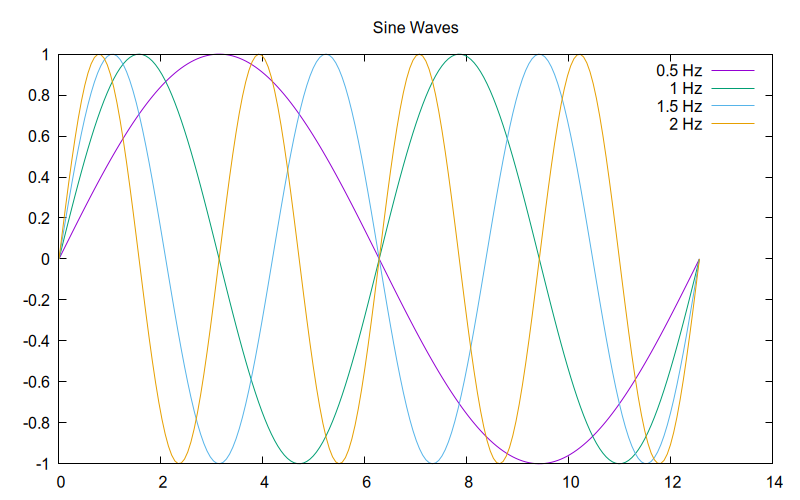
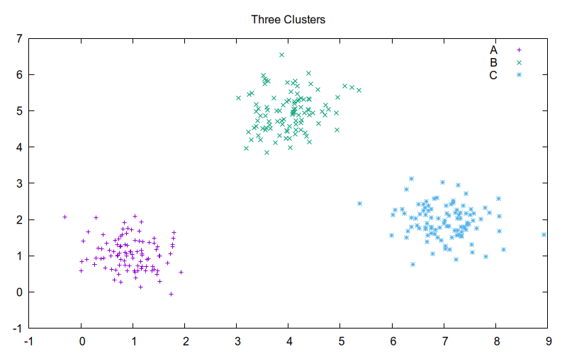
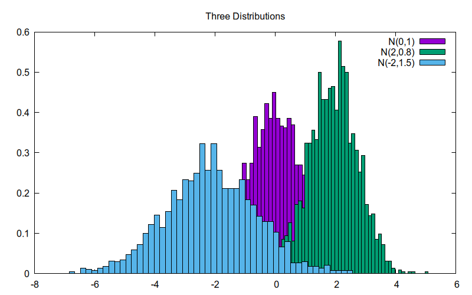
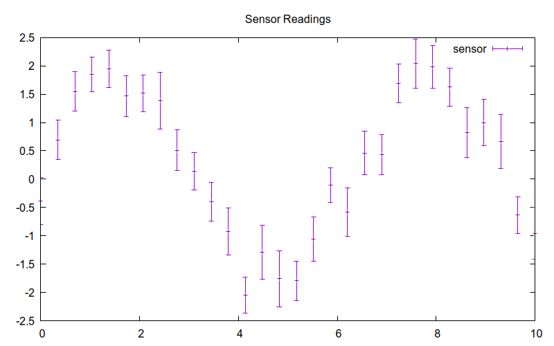
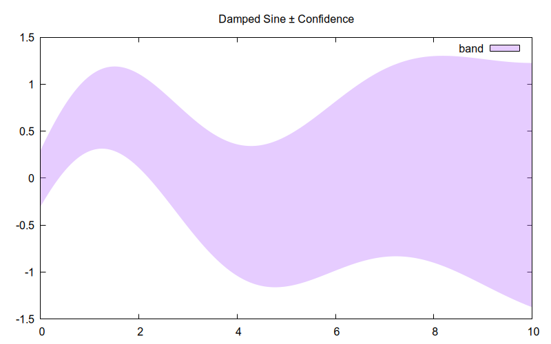
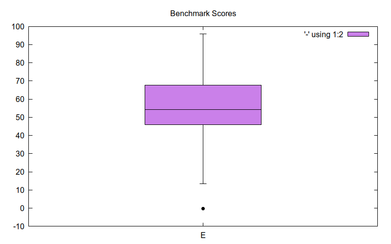
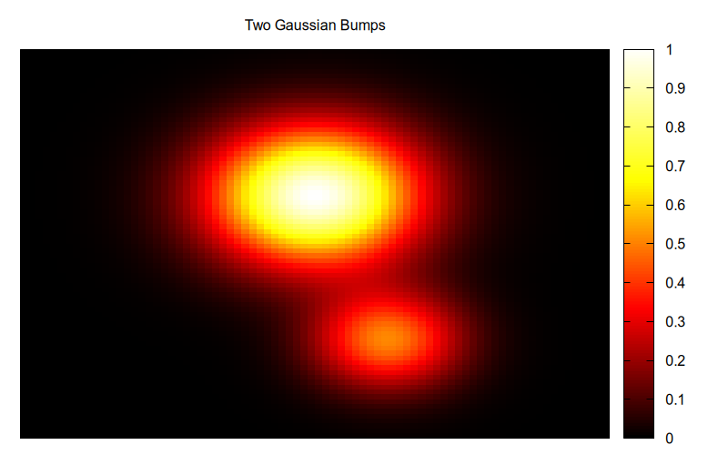
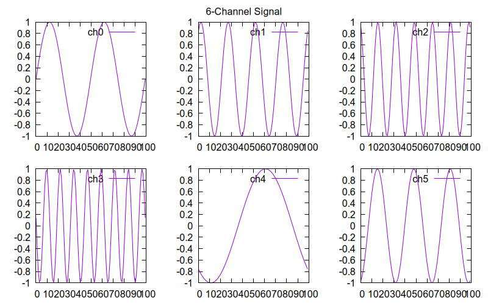

# liveplots

[](https://github.com/fccoelho/liveplots/actions/workflows/ci.yml)
[](https://pypi.org/project/liveplots/)
[](https://pypi.org/project/liveplots/)
[](https://www.gnu.org/licenses/gpl-3.0.html)
[](https://github.com/astral-sh/ruff)
[](https://github.com/astral-sh/ruff)

Real-time live plot server using ZeroMQ and Gnuplot.

## Description

`liveplots` serves a minimalistic plotting API over ZeroMQ.
Plot commands are sent fire-and-forget via PUSH/PULL sockets — the calling
process is never blocked waiting for a response.
Plots are generated by [Gnuplot](http://www.gnuplot.info/).

The purpose of this package is to monitor long-running computations without
interfering with them (i.e. slowing them down).

Multiple plot servers can be started, each on its own daemon process.

## Requirements

- Python 3.12+
- Gnuplot (install via `apt install gnuplot` on Debian/Ubuntu,
  `brew install gnuplot` on macOS)

## Installation

```bash
uv add liveplots
```

Or with pip:

```bash
pip install liveplots
```

## Quick Start

```python
from numpy import random
from liveplots import PlotServer

pserver = PlotServer(port=0, persist=1)

data = random.normal(0, 1, 1000).tolist()
data2 = random.normal(4, 1, 1000).tolist()

pserver.lines([data, data2], [], ["data", "data2"], "Two plots")
pserver.flush_queue()
```

More examples in the [`examples/`](examples/) directory.

## Plot Gallery

| Lines | Scatter | Histogram |
|:---:|:---:|:---:|
|  |  |  |

| Error Bars | Filled Curves | Boxplot |
|:---:|:---:|:---:|
|  |  |  |

| Heatmap | Multiplot |
|:---:|:---:|
|  |  |

## File System Monitor

The package also includes a cross-platform file system monitor based on
[watchdog](https://python-watchdog.readthedocs.io/):

```python
from liveplots import Monitor

def action(fpath):
    print(f"File changed: {fpath}")

monitor = Monitor("/tmp", ["create", "modify"], action)
```

## License

GPL-3.0-or-later
